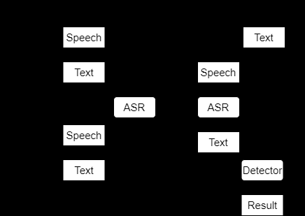

# Thesis 1: “Speech Scoring and Wrong Pronunciation Detection for Non-Native Japanese Learners Based on End-to-End Speech Recognition” (Yang Tingcheng, 2023)

## Background & Motivation

Learning proper Japanese pronunciation is challenging for non-native learners, especially given the shortage of instructors relative to the growing number of learners. Many students must self-study speaking without feedback, since exams like JLPT don’t include an oral component. This thesis tackles two complementary needs in this context: (1) Automated Pronunciation Scoring – to evaluate a learner’s spoken Japanese quality, and (2) Mispronunciation (Wrong Pronunciation) Detection – to pinpoint specific pronunciation errors, so that learners can become aware of and correct them. The goal is to provide an automated system that, while not a replacement for a teacher, can give objective feedback on pronunciation performance, thereby aiding self-study.

Conventional approaches to pronunciation scoring often relied on automatic speech recognition (ASR) with Hidden Markov Models (HMMs) or phone-level goodness measures (Goodness of Pronunciation scores), which required manual phoneme alignments or expert-defined features. In contrast, this thesis explores modern end-to-end (E2E) deep learning approaches that learn directly from audio to scores or error indicators, eliminating the need for manual alignment or predefined phoneme-level scoring. By leveraging E2E models, the system can be simpler and more data-driven. The work is specifically targeted at beginner-level Japanese learners (in this case, Chinese native speakers learning Japanese) whose speech often contains prominent pronunciation errors.

## Approach Overview

1. **Pronunciation Scoring Model:**

The thesis first develops a model that listens to a speech sample and predicts a pronunciation quality score for that sample. Unlike many ASR-based scoring methods, this approach does not require performing full speech recognition or forced alignment to a reference transcription. Instead, it treats scoring as a regression problem on acoustic features. Several neural architectures were tried for this scoring task, including a 2-layer unidirectional LSTM, a BiLSTM, and a Transformer encoder network. All these models take low-level acoustic features (e.g. MFCC, filterbank, spectrogram, or PLP features) as input and output a numerical score, training with a Mean Squared Error loss to match human teacher ratings. By avoiding explicit phoneme modeling or ASR decoding, the scoring model can remain lightweight and focused purely on pronunciation-related characteristics (like clarity, accent, etc.) in the audio.

2. **Mispronunciation Detection Methods:**

In addition to scoring, the thesis addresses detection of specific pronunciation errors that are common for learners. It particularly targets errors like missing geminate consonants (e.g. not pronouncing the small tsu「っ」), devoicing mistakes (e.g. voicing a consonant incorrectly), and missing long vowels. Two E2E-ASR-based strategies are proposed to detect these errors:

  - **Method 1:** Training with Error Labels. In this approach, the training transcripts are augmented with special labels inserted at positions of known mispronunciations. For example, if a training audio contains a gemination error, a special symbol might be inserted in the transcription at that point. An end-to-end ASR model is then trained to output these error labels when such mispronunciations are present. During inference (evaluation), if the ASR’s decoded output for a learner’s speech includes an error label, it indicates that particular wrong pronunciation was detected in the speech. Essentially, the ASR model learns to explicitly tag errors in its output.

  - **Method 2:** Transcript Modification and Comparison. This method avoids using special labels, instead leveraging the ASR output differences. The idea is to modify the reference transcript of training data to reflect the pronunciation mistake, so the ASR is trained to recognize the mispronounced word as it is actually pronounced. For example, for the word 「しっかり」(shikkari, “properly”), a common learner error is to not hold the geminate “っ” (tsu). In training, if the audio misses the geminate, the transcript is deliberately written as 「しかり」(shikari, missing the small tsu). A powerful E2E ASR (with a hybrid CTC/Attention architecture) is trained on such data so that it will transcribe what it actually hears – outputting 「しかり」 when the geminate is dropped versus 「しっかり」 when pronounced correctly. At runtime, a separate detector module then compares the ASR’s output with the expected correct text: if there’s a mismatch (e.g. ASR output “shikari” vs expected “shikkari”), the system flags it as a mispronunciation of that type. This method essentially turns mispronunciation detection into a comparison between ASR hypothesis and reference, given an ASR model trained to be sensitive to those errors.

Both methods rely on a strong **E2E ASR model** to either tag or differentiate errors. The ASR architecture used is a state-of-the-art Hybrid CTC/Attention model built with ESPnet toolkit. It employs a 12-layer Conformer encoder and a 6-layer Transformer decoder, combining the Conformer’s convolution-augmented self-attention for robust acoustic modeling with the attention-based seq2seq decoding. This powerful architecture allows the system to learn pronunciations directly from audio and text pairs. Figure 8 and Figure 9 of the thesis illustrate the two methods: Method 1 inserts labels during ASR training, whereas Method 2 trains the ASR on altered transcripts and uses a post-ASR detector (see conceptual diagram below).

## Dataset and Annotation

Two speech datasets were used to train and evaluate the models:

- **JRF Dataset:** The “Japanese Speech Database Read by Foreign Students” (JRF) is a known corpus of 141 foreign learners (from 26 different native languages, mostly intermediate-to-advanced proficiency) reading Japanese. Each recording in JRF has an overall pronunciation score (1–5) given by evaluators. However, this dataset posed challenges for the thesis’s goals. Since the speakers are fairly proficient, pronunciation errors are rare in JRF (only 8 instances of the specific errors of interest, all of them voicing errors). Additionally, the scoring in JRF is one-dimensional and somewhat imbalanced – most speakers received high scores, with very few low-score examples, making it hard for a model to learn what differentiates a “2” vs a “4” in pronunciation quality. The criteria used by JRF for scoring are also not fully transparent (introducing uncertainty in what the scores truly reflect). These issues meant JRF alone was insufficient for training a robust model for either scoring or error detection in this study.

- **New Custom Dataset:** To complement JRF, Yang collected a new dataset targeted at beginner-level pronunciation. It consists of 26 Chinese native speakers learning Japanese, each reading a set of phrases designed to elicit common pronunciation mistakes. The content includes 160 isolated words and 28 sentences that are known to be tricky (e.g., words with geminate consonants, long vowels, or hard-to-distinguish sounds). For each recorded utterance, three native Japanese teachers provided ratings in three categories:

  - ***Mispronunciation score:*** How many obvious mispronunciations are present (rated 1 = many errors, 3 = some minor errors, 5 = no mispronunciation).

  - ***Smoothness & Accent score:*** The naturalness of pronunciation and intonation (1 = very unnatural or choppy, 3 = acceptable, 5 = native-like smoothness).

  - ***Overall pronunciation score:*** An overall intuitive quality score integrating both correctness and accent (1 = poor, 5 = excellent).

These fine-grained ratings give the model multiple aspects to learn. Importantly, the dataset also deliberately includes specific known errors: e.g., 28 samples with a geminate consonant mispronounced, 5 with a voiced/unvoiced consonant error, and 5 with a long-vowel length error. A Japanese teacher also verified and annotated these error occurrences. This gave at least some positive training examples for the detection task (though still relatively few). The dataset was split into training, validation, and test sets (approximately 80%–10%–10%) for both scoring and detection experiments. Notably, even within this carefully designed set, audio quality issues (background noise, etc.) were present, reflecting real conditions.

Before modeling, the inter-rater reliability of the teacher scores was analyzed. The teachers did vary in their judgments – for example, one teacher tended to give higher scores on average. The Pearson correlation between teachers’ scores ranged roughly 0.55–0.62, indicating moderate agreement (for reference, a perfect agreement would be 1.0). This provided a useful benchmark: an automatic scoring model doesn’t need to reach 100% correlation with any individual teacher to be as good as a human – if it can reach a correlation on par with the average agreement between two teachers (~0.6), it can be considered quite successful. This benchmark was used when evaluating the scoring model’s performance.

## Model Training and Techniques

For pronunciation scoring, the acoustic feature inputs experimented with include standard choices: Mel-Frequency Cepstral Coefficients (MFCC), mel-scale filterbank energies (FBANK), spectrogram, and Perceptual Linear Prediction (PLP) features. These features were extracted from audio using typical signal processing pipelines. Each model (LSTM, BiLSTM, Transformer) was trained to output a score for each of the three rating categories (mispronunciation, smoothness, overall). Training used the combined data (primarily the new dataset for robust variation, with JRF data possibly used for additional training on overall score). Mean squared error loss was used to make the model’s predicted scores as close as possible to the average teacher scores. Because the data was limited, the author also tried data augmentation (e.g., speed perturbation on audio) and oversampling of rarer examples to help the models learn. In particular, the imbalance in JRF was addressed by re-sampling lower-score examples more frequently.

For the mispronunciation detection models, training was performed using the new dataset’s subset of labeled errors (augmented by the few JRF instances available). The E2E ASR model (Conformer encoder + Transformer decoder) was implemented with ESPnet and optimized with its standard recipe (CTC and attention losses). Method 1 required preparing transcripts that include an error token; since very few training utterances actually contained errors, Method 1’s training data was sparse. Method 2 effectively doubles the training data for ASR: for each utterance with a known error, there are two transcripts – one the correct intended transcript (for when the word is pronounced correctly), and one the “mispronounced” transcript (for when the error occurs). This way, the ASR model learns both variants. After training, detection is done by a simple text comparison script that flags differences between ASR output and the expected text.

The system was evaluated mainly on the new dataset’s test set, since it contains ground truth for both scores and specific errors. Standard metrics were used: Pearson correlation coefficient (PCC) for scoring accuracy (comparing model score vs. average teacher score), and Recall/Precision for error detection (how many of the actual errors were caught, and what fraction of flagged instances were truly errors).

## Experimental Results

**Pronunciation Scoring:** Among the model architectures tested, the Transformer encoder model achieved the best performance for predicting pronunciation scores. In fact, the Transformer-based scoring model (especially using MFCC features as input) reached a Pearson correlation coefficient around 0.70–0.73 with the teachers’ scores on the new dataset. This is notable because it actually exceeds the inter-teacher agreement level (~0.55–0.62 PCC). In other words, the model’s scoring consistency with the human raters is on par with, or even slightly better than, the consistency between two different human teachers. Figure 14 in the thesis showed a scatter plot of model-predicted scores vs. teacher scores, where the Transformer model’s points aligned very close to the diagonal line (ideal agreement), much better than the LSTM model’s scatter. The BiLSTM had intermediate performance (improving over the vanilla LSTM but not reaching the Transformer’s level). These results demonstrate that the attention-based Transformer encoder was more effective at extracting relevant pronunciation features than the RNNs – likely because the self-attention mechanism can focus on important segments of the audio (e.g., unusual pronunciations) and is robust to irrelevant variations like noise. It was also observed that MFCC and FBANK features outperformed spectrogram/PLP for this task, with MFCC slightly giving the highest PCC. The final Transformer scoring model using MFCC achieved a PCC of about 0.70 on overall scores, which actually slightly exceeded the highest PCC between any pair of human teachers (around 0.62). This suggests the model’s scoring is quite reliable. The author notes that this is a promising result: an automated scoring system that is as consistent as human raters could be a useful tool to approximate teacher feedback when teachers are not available.

One interesting finding was that scoring on the older JRF dataset was much harder for the models. The LSTM and BiLSTM performed poorly on JRF (low correlations), likely because JRF’s scores had less variation or unclear distinctions. The Transformer improved the scoring on JRF as well, but still only reached PCC ~0.59 on JRF. This contrast supports the earlier notion that JRF’s data was not very rich for learning (many similar high-end pronunciations). The custom dataset, with more varied and clearly delineated pronunciation quality, was crucial for training a successful model. Additionally, applying oversampling to bolster examples of low-scored pronunciation in training further improved the Transformer’s performance (bringing its PCC up by a few points on those categories).

**Mispronunciation Detection:** The two proposed methods were tested on detecting the three targeted error types (geminate consonant omission, voiced/unvoiced consonant confusion, and long vowel omission) in the test set. The outcomes highlight the challenge of limited data, but also show that the approach can work. Method 1 (with explicit error labels) had quite low success: it achieved a Recall of only ~29.4%. In absolute terms, out of 17 total mispronunciation instances in the test set, Method 1 only caught 5 of them (true positives), missing 12 (false negatives). The Precision of Method 1 is not directly given (since it caught so few, precision was high by default), but clearly many errors were not detected. The thesis provides some examples: Method 1 did work in cases like detecting a missing “っ” in 「うっかり」 (ASR output was 「う▲かり」 with a special symbol), but it failed in others where the model simply didn’t output the label when it should have. The author suggests that with so few labeled error instances to learn from, the ASR often never learned to reliably output the special token.

**Method 2 (transcript comparison)** performed significantly better. It achieved Recall ≈ 64.7% and Precision ≈ 78.6% in detecting the specific errors. In other words, it caught about two-thirds of all mispronunciations in the test set, and when it flagged an error, it was correct roughly 79% of the time. Concretely, Method 2 correctly detected 11 out of 17 mispronounced instances, missing 6 (FN), and it produced a few false alarms (FP) where a correctly pronounced word was mistakenly flagged. For example, if a student said 「しっかり」 correctly but the ASR mistakenly output 「しかり」, the system would falsely signal a gemination error. Some error types were easier to detect than others: geminate consonant omissions were relatively well detected, whereas certain voicing errors could be missed if the ASR didn’t transcribe the difference (e.g. the 「かいちゅう」 example where a voiced error wasn’t reflected in ASR output). The overall Word Error Rate (WER) of the ASR in Method 2’s scenario was about 26%, but this is not very meaningful to the detection task – the high WER was mostly due to other pronunciation mistakes in the sentences that were outside the three targeted types. The key point is that Method 2 demonstrated the feasibility of using an end-to-end ASR approach to catch pronunciation errors to some extent. A recall of ~65% is moderate – it means the system can find a fair number of errors, but will miss some – and the author acknowledges this performance is still “disappointing” in an absolute sense. The primary limitation is the scarcity of training data for specific errors: the ASR cannot learn the subtle difference between correct vs. incorrect pronunciation of, say, a voiced consonant if it only sees a handful of examples of that error. Thus, many errors go undetected (false negatives) and sometimes normal variations are misdetected as errors (false positives) because the model isn’t perfectly discriminative yet.

Overall, Method 2 outperformed Method 1 by a large margin in recall, indicating that the strategy of using modified transcripts and comparing outputs is more effective given small data. It makes intuitive sense: Method 2 leverages the powerful ASR to differentiate pronunciations in a flexible way, whereas Method 1’s binary tagging approach struggled without enough examples. The thesis thus mainly highlights Method 2’s results as evidence that end-to-end ASR can indeed be repurposed for pronunciation error detection, though with the caveat that much more data (potentially hundreds of examples of each error) would likely be needed to reach high accuracy.

## Conclusions and Future Work

Yang’s thesis concludes that end-to-end deep learning models are a promising approach for both evaluating and diagnosing pronunciation for language learners. The best scoring model (Transformer encoder) was able to achieve scoring consistency on par with human teachers, meaning it can reliably judge pronunciation quality in a way that correlates well with expert opinion. This is an encouraging result for computer-assisted pronunciation training – such a model could potentially be used in a software tool to give learners immediate feedback on their speaking performance (e.g., scoring their pronunciation of practice phrases on a 1–5 scale). For mispronunciation detection, the thesis demonstrates a novel use of E2E ASR to spot specific errors. While the accuracy was limited by data, the fact that the system detected around two-thirds of the errors with no manual phonetic annotation is notable. It validates the feasibility of the approach: with more training data covering a wider range of mispronunciations, an E2E ASR-based detector could become a valuable component of a pronunciation training system.

That need for more data is a primary point in the future work directions. The author emphasizes that a larger, well-annotated non-native speech dataset is needed – ideally including many examples of each kind of pronunciation mistake – to train robust detection models in the future. Expanding the dataset beyond the initial 26 speakers (e.g., to 100+ learners) and including more languages and pronunciations would improve model generalization. Another suggestion is to explore approaches beyond just ASR for detection – for instance, using acoustic anomaly detection or comparing student audio with native audio at the acoustic feature level (to potentially catch errors even when ASR output doesn’t change). Techniques like pronounced phoneme duration or formant frequency analysis could be combined with the attention model to flag subtle mispronunciations. The thesis also notes the importance of handling rare error types: some pronunciation errors (like certain intonation or accent issues) were not addressed in this work; developing methods to detect those, perhaps by incorporating prosodic features (pitch, timing) or by training multi-task models that handle accent and phoneme errors together, would be valuable.

In summary, Yang Tingcheng’s 2023 work laid the foundation by showing that: (a) Transformer-based models can effectively score pronunciation quality, matching inter-rater reliability, and (b) E2E ASR can be adapted to detect specific pronunciation errors with moderate success given limited data. This work provides a baseline and many insights that subsequent research (including the next thesis by Wu) can build upon. Notably, it highlighted the data bottleneck and opened the door to using internal model features (like attention) to glean pronunciation cues, which the next thesis explores further.

---
